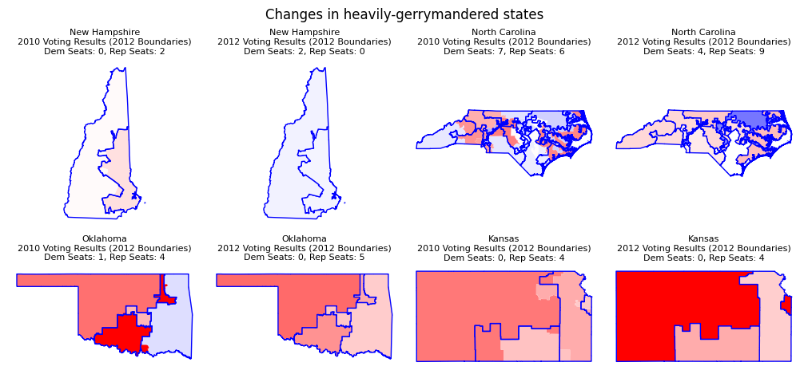

# Evaluating the Impact of 2021 Nationwide Redistricting on 2024 US Presidential Elections

**University of Chicago - Machine Learning & Predictive Analytics (ADSP 31009) Final Project**

*Project by Toby Chiu - University of Chicago MS Applied Data Science Student*

All 50 states redrew congressional voting districts in 2021. How will nationwide redistricting efforts affect the presidential election in 2024? 

## Technical Goal

Predicting gerrymandering metrics by applying a convolutional neural network (CNN) on redistricted congressional district maps to evaluate the presence of gerrymandering across all districts.

## Introduction

The US votes on presidential elections through a system known as the electoral college, where all 50 states send varying numbers of representatives (depending on population size) to vote for the next president. 

Every ten years, state representatives redraw voting district lines to keep district populations representative of the makeup of actual voters within each district. The federal government mandates that redistricting is done to with equal state legislative representation for all citizens, without discrimination on the basis of race or ethnicity ([Ballotpedia](https://ballotpedia.org/Redistricting) - more info included in link).

However, there is a wealth of evidence to suggest that state lines are often drawn to favor voting outcomes for a party through various techniques, often known as **"Gerrymandering"** ([Brennan Center](https://www.brennancenter.org/our-work/research-reports/gerrymandering-explained)). The [Voting Rights Act of 1965](https://www.archives.gov/milestone-documents/voting-rights-act?_ga=2.99238622.1949216050.1715659324-971477195.1715659323) effectively banned gerrymandering on the basis of reducing the voting power of racial minorities. However, many states  bypass this issue by redrawing districts directly based on voting preferences, which often lie closely with racial, socioeconomic, or ethnic makeups across states. [Amos, Gerontakis, and McDonald (2023)](https://esra-conference.org/files/election-science-conference/files/changing_precinct_boundaries_esra-brianamos.pdf) conducted extensive analysis to find that gerrymandered districts often contained more minorities after redistricting on average (a common symptom of "packing" - a gerrymandering tactic), which often led to lower voting turnout than expected. (A recent Supreme Court case found this to be true in Alabama - info [here](https://www.youtube.com/watch?v=_y_CCiwKzQw&ab_channel=Vox)).

The most notable example of gerrymandering occurred in 2010, when Republicans donated $30M into "[Project REDMAP](https://www.redistrictingmajorityproject.com/) (Redistricting Majority Project)", pouring large amounts of political funding into winning statewide elections in light-blue swing states with majority Democrat-voting citizens, before severely gerrymandering 10 states in the 2011 redistricting cycle, winning the 2012 US House elections by 33 seats while losing the nationwide popular vote ([The Atlantic](https://www.theatlantic.com/politics/archive/2017/06/how-deep-blue-maryland-shows-redistricting-is-broken/531492/)). (More info + quotes can be found in this interesting article: [tecznotes](http://mike.teczno.com/notes/redistricting.html))

All eligible states redistricted in the 2021 redistricting cycle ([FiveThirtyEight](https://projects.fivethirtyeight.com/redistricting-2022-maps/)). At least 16 states, including states with legislatures held by both parties, saw legal challenge to their originally proposed redistricting maps ([All About Redistricting](https://redistricting.lls.edu/national-overview/?colorby=Court%20Action&level=Congress&cycle=2020)). Many states are still in litigation process just months before the 2024 presidential elections, showing how abundant and hotly-contested gerrymandering practices are across both parties, as well as how effective gerrymandering is in winning votes through an unconstitutional fashion. **The redistricting effort in 2021 may lead to large changes in expected voting performance from each state - this is what this project aims to quantify.**

This short video explains gerrymandering in greater detail: [Vox](https://www.youtube.com/watch?v=QZZwoObFMhU&ab_channel=Vox).

## Methodology

### Partisan Gerrymandering Metric - Efficiency Gap

As data mapping and analytical methods have improved over the years, there have been efforts by many organization to devise metrics and strategies to value the extent of gerrymandering from both parties.

A common technique used in determining the extent of partisan gerrymandering is through the **Efficiency Gap**, developed by Nicholas Stephanopoulos (a UChicago professor!) and Eric McGhee ([Brennan Center](https://www.brennancenter.org/sites/default/files/legal-work/How_the_Efficiency_Gap_Standard_Works.pdf) - an example is given in the paper). The efficiency gap determines the difference in "wasted" votes from both parties in any given area, with wastage defined as: 

(total winning wasted votes - total losing votes) / total votes

A completely balanced map should have a zero efficiency gap, with an example 0.20 efficiency gap meaning the winning party won 20% more seats than the voting results would have suggested.

This article provides a visual interpretation of the efficiency gap metric: [tecznotes](http://mike.teczno.com/notes/redistricting/measuring-efficiency-gap.html)

### Analytical Plan

Our goal is to train a convolutional neural network (CNN) to predict the margin of efficiency gap for counties displaying potential signs of gerrymandering by looking at pictures of districts. We can train it on historical data by matching Voting Returns with Congressional District Maps.

1. Calculate efficiency gaps for previous statewide local election returns - this will serve as our target feature. [Code](metric_preprocessing.ipynb)

2. Match maps to election return data for each district. [Code - Heading Step 2](map_preprocessing.ipynb)

3. Turn maps into standardized pictures - features should be geoencoded into maps. [Code - Heading Step 3](map_preprocessing.ipynb)

4. Train a classification convolutional neural network (CNN) with accuracy as our primary loss function - goal is to predict presence of gerrymandering. [Code](model.ipynb)

5. Correct for underfitting/overfitting by tuning model.

6. Make predictions on updated maps of 2024 districts. [Code](predictions.ipynb)

### Assumptions
Our model trains using data from statewide elections (for the House of Representatives) as opposed to presidential elections. A large assumption is that these statewide election patterns transfer over to presidential elections - [not necessarily true but close enough](http://mike.teczno.com/notes/redistricting/measuring-efficiency-gap.html).

Another assumption we have taken is that gerrymandering patterns are roughly constant over time. Although this is not true (Democrats started heavily gerrymandering around the late 20th century, evening the gap between both parties), the gap is relatively negligent and can be ignored for our study.

CNNs also inherently assume that the input data:
1. contains a spatial hierarchy (the data contains a hierarchy or “levels” that determine patterns of increasing granularity)
2. is translation-invariant (patterns can be detected even if the underlying data is found in another image/another part of the same image) - this also means that the distribution of data should be roughly stationary over time

### Model Approach
We are aiming to build a multiclass convolutional neural network (CNN) to be able to capture whether a given map belongs to one of three classes: 

- (R) "Gerrymander for Republicans" - swing >= 0.05
- (NC) "No Change" - -0.05 > swing < 0.05
- (D) "Gerrymander for Democrats" - -0.05 <= swing

We will use accuracy as our primary metric in understanding what proportion of the model's predictions is accurate. If we see high class imbalances, we will instead focus on using precision and recall to understand how well our model performs.

#### Data Augmentation
Since we predict that our dataset size will be quite small, our data will be augmented through an ImageDataGenerator. To do this, we will perform two types of augmentation: flipping, and rotation.

I've refrained from conducting other types of augmentation (shearing, scaling, stretching, [etc.](https://sander.ai/2015/03/17/plankton.html)) as I wanted to preserve spatial relationships between districts (especially the differences between redistricting).

#### Data Challenges
We will use a 70/30 split for our data to make enough data available for testing, since our dataset is quite small. Within the training data, we will take a 80/20 split for validation to be able to track changes of our models through epochs.

We can correct for class imbalances through various methods (outlined by Buda et. al., 2017 [here](https://arxiv.org/pdf/1710.05381)).

The classic undersampling of majority class may lead to issues as our dataset should be quite small. 

Instead, we can choose to oversample from minority classes (ideally with augmented images). We can also choose to adjust the class weights for cost-sensitive learning to penalise minority misclassification at a higher level, forcing the model to better adjust for errors in minority classes. 

#### Model Approach 
1. We will start by building a baseline model that contains 1 input layer, 1 hidden CNN layer, and a dense layer, before a final dense layer that uses softmax to make multiclass classifications. The goal is to understand how well a basic model can make predictions, and set a baseline metric to improve upon.

2. We will then try to optimize our approach by tuning parameters such as convolution window, activation function, stride size, batch_size, and epochs. 

3. After finding the ideal parameters, we can improve the complexity of the model by introducing more kernels, more layers, or more advanced model architecture, until we reached our ideal performance level.

4. We can perform regularization on overfitted data by introducing dropout layers to ensure our model is more generalizable, and introduce early stopping to prevent our data from learning too much from training data.

#### Underfitting
If we encounter underfitting, we will increase the complexity of our model.

#### Overfitting
If we encounter overfitting (generally when training error is much lower than test error), we can introduce dropout layers to randomly mask nodes during training to prevent the output from overlearning noise within training data, as well as early stopping when training error diverges from testing error to stop the output from learning specific trends only in training data.

## Results
All of our results followed the same trends as this graph (showing metrics during training over epochs):

Accuracy scores tended to hover around 33% (essentially random guessing with 1/3 chance), and our precision and recall scores plummeted almost immediately (indicating our model being unable to guess right from wrong).

Our performance did not improve over epochs, overall suggesting **heavy underfitting** (despite increasing the complexity of our model + trying different types of improvements to our model architecture/parameters). It is most likely a mixture of non-ideal model architecture, untuned hyperparameters, and a very difficult task (particularly on my local machine). 

Our model predicted **36 Democratic gerrymandered states**, **7 states with no change**, and **0 Republican gerrymandered states** for the 2021 redistricting case; this would theoretically indicate a landslide win for Biden (by at least 72 votes if every gerrymandered state flipped 1 state), which would obviously be untrue. This is a sign of a poor-performing model - all 3 probabilities from softmax are incredibly close, indicating a difficulty in seperating between all 3 classes.

### Takeaways
There are some takeaways/findings from the experience:
1. **None of the parameters does not seem to matter.** The models seem to pick up on red herrings/other patterns and are unable to capture the nuance behind gerrymandering, despite introducing more complexity into the model (as much as my local machine can take - cloud computing would help in this regard.)
2. Training on nuanced trends within maps may be **incredibly difficult for a CNN** - it may require more complex types of convolution models to pick up necessary 
3. My **sample size is too small, despite image augmentation.** This makes it easy to overfit across the small sample size (my models did not get to this stage regularly - I could not fit my model to any trends in the maps). To improve this, we would require either fake maps that have calculated voting (which may differ to real life), or to get maps that go further back in time.

## Data Sources
- State Legislative Election Returns, 1948-2016: [Princeton Gerrymandering Project](https://gerrymander.princeton.edu/resources/) *(Note: This dataset is sometimes incorrectly cited by many sources, and an alternative is often cited: [Harvard Dataverse (Carl Klarner)](https://dataverse.harvard.edu/dataset.xhtml?persistentId=doi:10.7910/DVN/3WZFK9))*

- United States Congressional District Shapefiles, 1789-2017: [UCLA - Jeffrey B. Lewis, Brandon DeVine, and Lincoln Pritcher with Kenneth C. Martis](https://cdmaps.polisci.ucla.edu/)

- United States Congressional District Shapefiles, 2020, 2024: [Daily Kos](https://docs.google.com/spreadsheets/d/1LrBXlqrtSZwyYOkpEEXFwQggvtR0bHHTxs9kq4kjOjw/edit#gid=0)

- United States Historical City Populations, 1790-2010: [Stanford Spatial History Project - Erik Steiner, Jason A. Heppler](https://github.com/cestastanford/historical-us-city-populations/tree/master)

- United States Historical City Populations, 2020: [ArcGIS](https://hub.arcgis.com/datasets/esri::usa-major-cities/explore)

## Suggested Improvements
- Data quality for election data by congressional districts are surprisingly poor. I have tried my best to source accurate data. A more concerted effort through an effort of web scraping/data sourcing may yield more accurate results.

- Other (more advanced) metrics have been created for to quantify partisan gerrymandering from legal ([Stanford Law Review](https://www.stanfordlawreview.org/print/article/three-tests-for-practical-evaluation-of-partisan-gerrymandering/)) and statistical ([Wang, 2016](https://web.math.princeton.edu/~sswang/wang16_ElectionLawJournal_gerrymandering-MD-WI_.pdf), [Princeton Gerrymandering Project](https://gerrymander.princeton.edu/)) standpoints. These metrics may be used to substitute/complement the efficiency gap metric in measuring how and to what extent gerrymandering plays a part in presidential elections.

- There have been attempts (e.g. [BDistricting](https://bdistricting.com/2010/)) to create more equal (or [hilarious](https://fakeisthenewreal.org/random-states-of-america/)) redistricting maps that aim to reduce gerrymandering - we can take hypothetical districts and further improve our model (and create a larger sample size)

- Other approaches to algorithmically detect gerrymandering have been tried in the past (e.g. [Computational Method for Identifying Extreme Redistricting Plans - Prof Wendy Tam Cho](https://www.youtube.com/watch?v=gRCZR_BbjTo&ab_channel=Vox)) - we can apply deep learning to augment/improve one or more of these approaches

## Future Developments 
- Building a front-end (a Streamlit app, Dash app, or a full-fledged stack) can be useful in creating intuition behind gerrymandering, while letting others explore the history and potential of this political tool. 